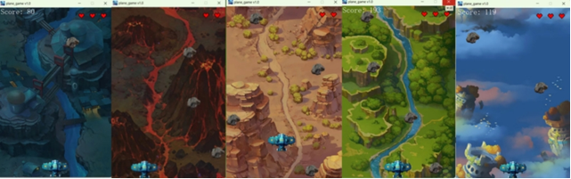
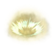
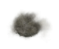
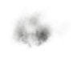
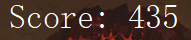
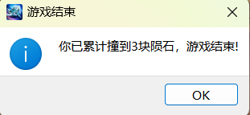
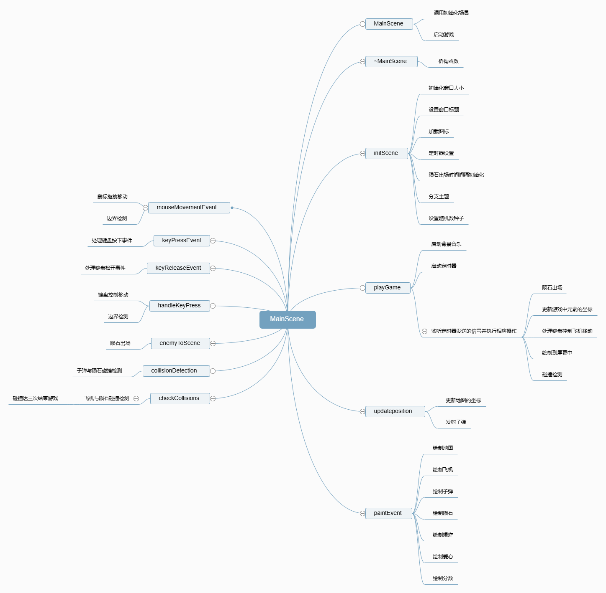
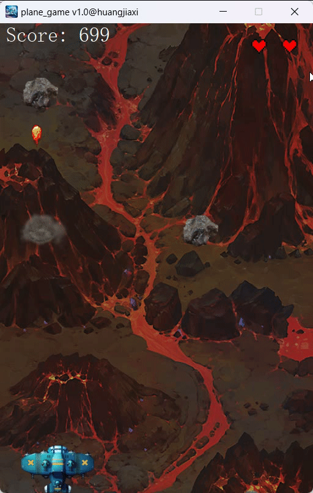

# 基于QT的陨石撞飞机游戏的设计与实现  

## 一、中文摘要
本文介绍了一款基于QT框架开发的陨石撞飞机游戏的设计与实现。通过利用QT的图形界面编程能力，游戏提供了简单而有趣的用户体验。在游戏中，玩家可利用键盘或鼠标控制飞机躲避从上方落下的陨石，累计碰撞三次后游戏结束。同时，玩家还可以按住空格键使飞机发射子弹，击碎陨石。本文详细描述了游戏的开发过程、系统测试情况以及系统的优点与不足。  

**关键词：QT框架, 游戏开发, 陨石撞飞机, 图形界面**  

## 二、前言  
随着计算机技术的发展，基于图形用户界面的游戏开发变得越来越普遍。QT作为一个功能强大的跨平台C++图形用户界面应用程序开发框架，被广泛应用于各类软件开发中。在本项目中，我使用QT框架开发了一款陨石撞飞机的游戏。通过该项目我不仅学习了QT的基本使用方法，还锻炼了我在游戏开发中的综合能力。  

## 三、软件的开发过程  
### 1.需求分析  
在开发过程中，我首先明确了游戏的基本需求：  
①玩家可通过WASD键和方向键以及鼠标控制飞机上下左右移动，躲避从上方落下的陨石。  
②每当玩家的飞机与陨石发生碰撞时，显示爆炸效果并提示玩家发生碰撞。  
③当玩家累计碰撞三次陨石后，游戏结束并显示相应提示。  
此外，我还为飞机添加了发射子弹的功能，使得子弹能够击碎陨石，增强游戏的可玩性，也为后续的玩法拓展做铺垫。  

### 2.系统设计  
根据需求分析，整个系统主要包括以下模块：  
①主场景模块：配置游戏的各项数据，包括游戏界面、地图、飞机、子弹、陨石、爆炸、音效和生命值。  
②地图滚动模块：利用定时器实现循环滚动背景地图。  
③飞机控制模块：管理飞机的状态，处理玩家对飞机的控制输入。  
④子弹发射模块：管理子弹的状态，处理玩家对子弹的控制输入。  
⑤陨石生成模块：定时在随机位置生成陨石。  
⑥碰撞检测模块：检测飞机与陨石的碰撞以及子弹与陨石的碰撞，并进行相应处理。  
⑦爆炸效果模块：播放爆炸动画。  
⑧音效添加模块：添加背景音乐和爆炸音效。  
⑨生命显示模块：显示剩余生命值。  
⑩分数记录模块：实时记录游戏的分数。  
⑪游戏逻辑模块：管理游戏状态，包括剩余碰撞次数和游戏结束判断。  

### 3.实现过程  
#### 3.1 主场景模块
①配置文件添加：添加配置文件config.h，用于记录程序中所有的配置数据，方便后期修改。    
②主场景基本设置：在mainscene.h中添加initScene函数实现游戏场景初始化，包含窗口大小和标题的设置，在mainscene的构造函数中调用initScene。  
③生成并编辑qrc文件。  
④qrc文件生成rcc二进制文件：在命令行中输入rcc -binary .\res.qrc -o plane.rcc 生成相应的rcc二进制文件。  
⑤注册二进制文件：利用QResource的registerResource函数注册外部的二进制资源文件。  
⑥添加图标资源：利用QIcon函数设置图标资源。    
#### 3.2 地图滚动模块  
①创建地图文件和类。map.h代码如下：
```c++
#ifndef MAP_H
#define MAP_H
#include <QPixmap>

class Map
{
public:
    // 构造函数
    Map();

    // 地图滚动坐标计算
    void mapPosition();

public:

    // 地图图片对象
    QPixmap m_map1;
    QPixmap m_map2;

    // 地图Y轴坐标
    int m_map1_posY;
    int m_map2_posY;

    // 地图滚动幅度
    int m_scroll_speed;

    // 分数记录
    int m_score;
};

#endif // MAP_H
```
②绘制地图：在mainscene::paintEvent函数中利用QPainter绘制地图。  
③定时器添加：利用QTimer添加定时器对象，设置定时器频率。  
④启动定时器实现地图滚动：监听定时器并实时更新游戏中所有元素的坐标，重新绘制图片。  
⑤随机选择地图：为了增强游戏的可玩性，我设置了五种不同的地图（黑夜、火山、沙漠、溪流、城堡），并利用随机数选择地图路径，玩家每次进行游戏的地图是随机的。  


#### 3.3 飞机控制模块
①创建飞机文件和类：heroplane.h代码如下：
```c++
#ifndef HEROPLANE_H
#define HEROPLANE_H
#include <QPixmap>
#include <QRect>
#include "bullet.h"

class HeroPlane
{
public:
    HeroPlane();

    // 发射子弹
    void shoot();
    // 设置飞机位置
    void setPosition(int x, int y);
    // 与敌机碰撞后调用该方法
    void collideWithEnemy();
    // 获取碰撞次数
    int getCollisionCount() const;

    //飞机资源 对象
    QPixmap m_Plane;

    // 飞机坐标
    int m_X;
    int m_Y;

    // 飞机的矩形边框
    QRect m_Rect;

    // 弹匣
    Bullet m_bullets[BULLET_NUM];

    // 发射间隔记录
    int m_recorder;

    // 记录空格键是否被按下,按下则开始发射
        bool m_isShooting = false;

};

#endif // HEROPLANE_H
```
②创建飞机对象并绘制飞机：在mainscene::paintEvent中利用QPainter绘制飞机。  
③实现鼠标拖拽飞机移动：使用鼠标事件处理函数mouseMoveEvent实现鼠标拖拽飞机移动。  
④实现键盘控制飞机移动：使用键盘事件处理函数keyPressEvent和keyReleaseEvent来捕捉玩家的按键操作，实现WASD键和方向键控制飞机的上下左右移动。  
#### 3.4 子弹发射模块
①创建子弹文件和类。bullet.h代码如下:
```c++
#ifndef BULLET_H
#define BULLET_H
#include "config.h"
#include <QPixmap>

class Bullet
{
public:
    Bullet();

    //更新子弹坐标
    void updatePosition();

public:
    //子弹资源对象
    QPixmap m_Bullet;
    //子弹坐标
    int m_X;
    int m_Y;
    //子弹移动速度
    int m_Speed;
    //子弹是否闲置
    bool m_Free;
    //子弹的矩形边框（用于碰撞检测）
    QRect m_Rect;
};

#endif // BULLET_H
```
②将飞机与子弹绑定，使得子弹从飞机射出。在飞机类中追加子弹发射函数shoot、弹匣数组m_bullets以及发射信号m_isShooting。  
#### 3.5 陨石生成模块
①创建陨石文件和类。meteor.h代码如下：
```c++
#ifndef METEOR_H
#define METEOR_H
#include <QPixmap>

class METEOR
{
public:
    METEOR();

    // 更新坐标
    void updatePosition();
public:
    // 陨石资源对象
    QPixmap m_enemy;

    // 位置
    int m_X;
    int m_Y;

    // 陨石的矩形边框（碰撞检测）
    QRect m_Rect;

    // 陨石状态
    bool m_Free;

    // 陨石速度
    int m_Speed;
};

#endif // METEOR_H
```
②设置陨石出场：在mainscene.h中追加陨石出场的成员函数enemyToScene，陨石数组m_enemys，陨石出场间隔记录m_recorder。  
#### 3.6 碰撞检测模块
①添加并实现碰撞检测函数：在mainscene.h中增加成员函数collisionDetection用于子弹与陨石的碰撞检测，增加成员函数checkCollision用于飞机与陨石的碰撞检测，在mainscene.cpp中实现函数。   
②调用并测试函数。  
#### 3.7 爆炸效果模块
①创建爆炸文件和类。Bomb.h代码如下：
```c++
#ifndef BOMB_H
#define BOMB_H
#include "config.h"
#include <QPixmap>
#include <QVector>

class Bomb
{
public:
    Bomb();

    // 更新信息（播放图片下标、播放间隔）
    void updateInfo();

public:

    // 放爆炸资源数组
    QVector<QPixmap> m_pixArr;

    // 爆炸位置
    int m_X;
    int m_Y;

    // 爆炸状态
    bool m_Free;

    // 爆炸切图的时间间隔
    int m_Recoder;

    // 爆炸时加载的图片下标
    int m_index;
};


#endif // BOMB_H
```
②加入爆炸资源数组：将爆炸不同阶段的资源图片用数组载入。  
③实现爆炸动画：爆炸动画是由多张爆炸图片连续播放实现的，所以爆炸图片的路径在配置时要写为%1，代表路径可变。设置好爆炸切图的时间间隔，并在播放时实时更新爆炸图片路径，在mainscene::paintEvent函数中追加绘制爆炸的代码，最终实现爆炸动画。  


#### 3.8 音效添加模块
①添加多媒体模块：在工程文件中添加多媒体模块multimedia。  
②播放音效：利用QSound播放背景音乐和爆炸音效。  

#### 3.9 生命显示模块
①创建爱心文件和类，heart.h代码如下：
```c++
#ifndef HEART_H
#define HEART_H
#include <QPixmap>

class Heart
{
public:
    Heart();

    // 更新坐标
    void updatePosition();
public:
    // 爱心资源对象
    QPixmap m_Heart;

    // 位置
    int m_X;
    int m_Y;

    // 爱心状态
    bool m_Free;
};

#endif // HEART_H
```
②创建爱心对象数组。  
③实现爱心显示。利用在mainscene::paintEvent函数中利用QPainter将三颗爱心等距绘制在屏幕右上角位置。  


#### 3.10 分数记录模块
①实现分数显示:在map.h中添加分数成员m_score并在构造函数中初始化为0，在main::paintEvent中利用QFont和QPainter绘制分数。  
②实现分数实时增加：绘制分数的同时自增++，实现分数不断增加。  


#### 3.11 游戏逻辑模块
①碰撞后碰撞次数加一，爱心减少一颗。当在checkCollisions函数检测到飞机与陨石发生碰撞后令一颗爱心状态为隐藏，并使记录碰撞次数的变量自增一。  
②碰撞次数大于等于三利用QMessageBox弹出对话框提示结束游戏。  


### 四、系统的优点与不足
#### 1.优点
①跨平台性：基于QT开发，支持多种操作系统，包括Windows、MacOS和Linux。  
②用户界面友好：采用QT的图形界面，界面简洁美观，操作简单。  
③操作简单易上手：游戏操作非常简单，老幼皆宜，简单而有趣。  
④画面美观，制作精良：各素材均经过精心挑选或设计，整体游戏画面和谐而富有美感。  
⑤扩展性强：代码结构清晰，具有良好的可维护性和扩展性。  

#### 2.不足
①功能单一：目前游戏功能较为简单，仅包含基本的躲避陨石玩法，缺乏更多的游戏元素和挑战。  
②缺乏菜单界面：点击游戏后就直接开始游戏，游戏结束后就立即退出，没有菜单界面允许玩家自行开始游戏，或在游戏结束后再来一局。  
③缺乏设置界面：用户无法自己更改游戏中的各种设置，如操作灵敏度、陨石下落速度、陨石数量、背景音乐大小、音效声音大小等。    
④用户引导不足：游戏缺乏新手引导，第一次玩游戏的玩家可能需要一定时间适应。游戏在刚开始时也没有无敌时间，玩家刚开始玩可能需要时间适应。  
⑤碰撞模型存在偏差：由于碰撞模型是矩形框，而飞机本身并不是严格的矩形，因此在陨石未碰到飞机时也有可能被检测为发生碰撞。  
⑥性能优化不足：在大量陨石同时生成的情况下，可能会出现一定的性能问题，需要进一步优化。  

### 五、参考文献
[1] 谭浩强. C++程序设计[M]. 第3版. 清华大学出版社, 2015.   
[2] Qt Group. Qt DOCUMENTATION[EB/OL]. [2024-06-15]. https://doc.qt.io/.  
[3]斧头帮-帮主. Qt案例_飞机大战[EB/OL]. 2021-01-28[2024-06-15].
https://www.bilibili.com/video/BV1xy4y1m794/.  
[4] 黑马程序员官方. C++学习教程，QT飞机大战教程（含详细步骤教程）[EB/OL]. 2020-02-10[2024-06-15].https://blog.csdn.net/itcast_cn/article/details/104251531.  

### 六、附录
#### Ⅰ.所用到的QT库
①QWidget：生成Qt主窗口  
②QTimer：用于爆炸切图和地图滚动的定时器  
③QKeyEvent：处理键盘事件  
④QMouseEvent：处理鼠标事件  
⑤QIcon：设置图标  
⑥QPainter：绘制游戏元素  
⑦ctime：返回系统当前时间，作为随机数种子  
⑧QFont：在游戏界面显示分数信息  
⑨QMessageBox：游戏结束时弹出对话框提示  
⑩QSound：播放背景音乐和爆炸音效  
⑪QPixmap：建立资源对象  
⑫QVector：建立爆炸资源数组  
⑬QRect：用于飞机与陨石以及子弹与陨石的碰撞检测  
⑭QApplication：生成Qt应用程序  
⑮QResource：注册外部二进制资源文件  
⑯cstdlib：生成随机数  

#### Ⅱ.系统组织结构


#### Ⅲ.游戏运行画面



